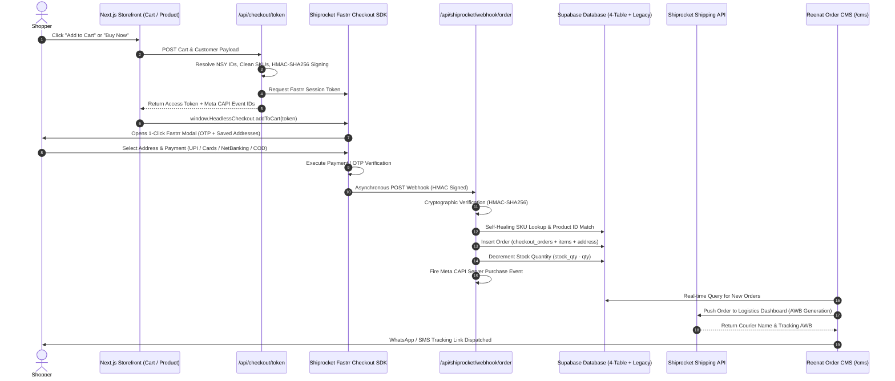

# Reenat Trends: Product Identity Architecture & End-to-End Order Flow Report

> **Document Version**: 1.0.0  
> **Target Audience**: Technical Architects, Engineers, AI Assistants (Claude / Antigravity), Operations  
> **Project**: Reenat Trends Storefront (`reenat-next`)  
> **Tech Stack**: Next.js App Router (Tailwind CSS v4), Supabase Database, Shiprocket Fastrr Headless Checkout, Shiprocket Shipping API, Meta Conversions API (CAPI).

---

## Table of Contents
1. [Executive Summary](#1-executive-summary)
2. [Part 1: Product ID, SKU ID & Catalog ID Architecture](#2-part-1-product-id-sku-id--catalog-id-architecture)
   - [2.1 Catalog ID (`catalog_id`)](#21-catalog-id-catalog_id)
   - [2.2 Product ID (Unique Saree ID – `NSYxxxx`)](#22-product-id-unique-saree-id--nsyxxxx)
   - [2.3 SKU ID (Seller SKU Code – `styleid`)](#23-sku-id-seller-sku-code--styleid)
   - [2.4 Identity Comparison & Rules Matrix](#24-identity-comparison--rules-matrix)
   - [2.5 Database Schema & Table Structure](#25-database-schema--table-structure)
3. [Part 2: End-to-End Order Flow (Step-by-Step Data Flow)](#3-part-2-end-to-end-order-flow-step-by-step-data-flow)
   - [3.1 Architecture Overview & Sequence Diagram](#31-architecture-overview--sequence-diagram)
   - [3.2 Step 1: Customer Storefront Action (Add to Cart vs. Buy Now)](#32-step-1-customer-storefront-action-add-to-cart-vs-buy-now)
   - [3.3 Step 2: Checkout Token Initialization (`POST /api/checkout/token`)](#33-step-2-checkout-token-initialization-post-apicheckouttoken)
   - [3.4 Step 3: Fastrr Headless Checkout UI & Payment Execution](#34-step-3-fastrr-headless-checkout-ui--payment-execution)
   - [3.5 Step 4: Webhook Processing & Cryptographic Verification (`POST /api/shiprocket/webhook/order`)](#35-step-4-webhook-processing--cryptographic-verification-post-apishiprocketwebhookorder)
   - [3.6 Step 5: Self-Healing Product Resolution & Dual-Write DB Persistence](#36-step-5-self-healing-product-resolution--dual-write-db-persistence)
   - [3.7 Step 6: Automated Inventory Stock Decrement & Meta CAPI Event](#37-step-6-automated-inventory-stock-decrement--meta-capi-event)
   - [3.8 Step 7: Shiprocket Logistics Shipping Dashboard Push (`pushOrderToShiprocket`)](#38-step-7-shiprocket-logistics-shipping-dashboard-push-pushordertoshiprocket)
   - [3.9 Step 8: Reenat Trends Order CMS Panel (`/cms`)](#39-step-8-reenat-trends-order-cms-panel-cms)
4. [Part 3: Complete Data Dictionary & Schema References](#4-part-3-complete-data-dictionary--schema-references)

---

## 1. Executive Summary

This document provides a comprehensive technical reference for the Reenat Trends e-commerce platform. It details the **3-Tier Product Identity Architecture** (`Catalog ID`, `Product ID`, `SKU ID`) and traces the **End-to-End Order Lifecycle** across all client interfaces, API endpoints, webhooks, databases, logistics providers, and admin management portals.

---

## 2. Part 1: Product ID, SKU ID & Catalog ID Architecture

The platform separates **Customer Presentation**, **System Integrity**, and **Warehouse Fulfillment** into three distinct layers:

```
   ┌─────────────────────────────────────────────────────────────┐
   │                   CATALOG ID (e.g. M1, M2, 101)              │
   │  Groups all color & style variations into ONE catalog page   │
   └──────────────────────────────┬──────────────────────────────┘
                                  │
         ┌────────────────────────┴────────────────────────┐
         ▼                                                 ▼
┌─────────────────────────────────┐       ┌─────────────────────────────────┐
│   PRODUCT ID: NSY0042           │       │   PRODUCT ID: NSY0043           │
│   (Database Row ID: 42)         │       │   (Database Row ID: 43)         │
│   Color: Mango Green            │       │   Color: Sea Green Rani         │
│   SKU ID: "MANGO GREEN PAI X1"  │       │   SKU ID: "M1||SagarRani Pa X1" │
└─────────────────────────────────┘       └─────────────────────────────────┘
```

---

### 2.1 Catalog ID (`catalog_id`)
* **Purpose**: Identifies the parent design or master style group. All color variations belonging to the same weave/design share the same Catalog ID.
* **Format**: Alphanumeric string (e.g., `1`, `2`, `3`, `M1`, `M2`, `M3`).
* **Database Mapping**: Stored in `products.catalog_id` (`text`).
* **Working & Behavior**:
  * **Storefront Grouping**: When a customer views `/product?id=NSY0042`, the app queries all items where `catalog_id == 'M1'` and renders them as clickable color swatches and thumbnails.
  * **Homepage Layout**: Catalogs control the homepage card sequence and showcase layouts.
  * **CMS Auto-Increment**: When adding a new saree design in `/cms`, the CMS automatically increments the Catalog ID or lets the merchant attach new color variants to an existing catalog.

---

### 2.2 Product ID (Unique Saree ID – `NSYxxxx`)
* **Purpose**: The absolute unique, immutable, system-generated identifier for every single saree variation.
* **Format**: Prefixed with `NSY` followed by the zero-padded database row ID:
  $$\text{Product ID} = \text{"NSY"} + \text{String}(\text{id}).\text{padStart}(4, \text{'0'})$$
  *(Examples: Row 42 $\rightarrow$ `NSY0042`, Row 127 $\rightarrow$ `NSY0127`, Extended 8-digit $\rightarrow$ `NSY10000042`).*
* **Database Mapping**: Stored in `products.id` (`bigint` / `serial` Primary Key).
* **Working & Behavior**:
  * **URL Routing**: Direct product URLs use this ID: `/product?id=NSY0042`.
  * **Append-Only Rule**: Adding a new color variation never overwrites or alters existing sarees. A new database row is inserted with a higher sequential `id`, automatically generating its own unalterable `NSYxxxx` Product ID.
  * **Cross-Linking**: Used by the `linked_to` column when linking related accessories or sarees across different catalogs.

---

### 2.3 SKU ID (Seller SKU Code – `styleid`)
* **Purpose**: Shipping, billing, sorting, dispatch, physical shelf binning, and warehouse packing identifier.
* **Format**: Custom string entered by admin (e.g., `MANGO GREEN PAI X1`, `M1||SagarRani Pa X1`, `Grey Black - NSY10000090`).
* **Database Mapping**: Stored in `products.styleid` (`text`).
* **Working & Behavior**:
  * **Flexibility**: Fully editable at any time without breaking customer URLs or database relationships.
  * **Non-Unique / Duplicates Permitted**: Multiple products across different suppliers or catalogs can share the same SKU ID without causing system collisions.
  * **Logistics Sanitization**: During Fastrr checkout token generation (`/api/checkout/token`), the system cleans internal prefixes (like `M1||`) and appends the clean `NSY...` suffix (`Seller SKU - NSY100000xx`) to guarantee zero-mismatch order tracking.

---

### 2.4 Identity Comparison & Rules Matrix

| Dimension | Catalog ID (`catalog_id`) | Product ID (`id` / `NSYxxxx`) | SKU ID (`styleid`) |
| :--- | :--- | :--- | :--- |
| **Scope** | Design / Group Level | Single Saree Variation Level | Warehouse / Logistics Level |
| **Uniqueness** | Shared across variants of a design | **Strictly Unique** (Global Primary Key) | Non-Unique (Merchant-defined) |
| **Mutability** | Editable (Re-assign catalog) | **Immutable** (Generated by DB Sequence) | **Fully Editable** anytime |
| **Primary Use** | Color swatches & homepage grouping | Routing, URLs, Cart state, DB lookups | Invoices, Packing labels, Logistics AWB |
| **Storefront Display** | Hidden or shown as Collection Tag | Displayed on product & return policies | Printed on order receipts & CMS |
| **Database Column** | `products.catalog_id` (`text`) | `products.id` (`bigserial`) | `products.styleid` (`text`) |

---

### 2.5 Database Schema & Table Structure

#### `products` Table (Inventory & Variations)
```sql
CREATE TABLE public.products (
  id              BIGSERIAL PRIMARY KEY,           -- Base for Product ID (NSY0042)
  catalog_id      TEXT NOT NULL DEFAULT '1',       -- Master Catalog Group ID (e.g. 'M1')
  name            TEXT NOT NULL,                   -- Saree Title
  type            TEXT DEFAULT 'Paithani',         -- Saree Category / Fabric Family
  color           TEXT,                            -- Variant Color (e.g. 'Sea Green Rani')
  price           NUMERIC NOT NULL,                -- Selling Price (e.g. 999)
  originalprice   NUMERIC,                         -- MRP / Strikethrough Price (e.g. 2499)
  stock_qty       INTEGER DEFAULT 50,              -- Available Physical Units
  styleid         TEXT,                            -- Seller SKU Code (e.g. 'M1||SagarRani Pa X1')
  linked_to       TEXT DEFAULT '',                 -- Cross-catalog linked Product ID
  image           TEXT NOT NULL,                   -- Front cover thumbnail (image_front)
  image2          TEXT,                            -- Back view / Pallu (image_back)
  image3          TEXT,                            -- Texture / Weave close-up (image_fabric)
  image4          TEXT,                            -- Model / Styling view (image_model)
  image5          TEXT,                            -- Detail angle 1 (image_extra1)
  image6          TEXT,                            -- Detail angle 2 (image_extra2)
  desc            TEXT,                            -- Artisan & Fabric Description
  fabric          TEXT DEFAULT 'Cotton Silk',      -- Fabric Details
  border          TEXT DEFAULT 'Zari',             -- Border Type
  sareelen        TEXT DEFAULT '5.5',              -- Saree Length in meters
  blouselen       TEXT DEFAULT '0.8',              -- Blouse Length in meters
  gst             TEXT DEFAULT '5',                -- GST Rate (%)
  hsn             TEXT DEFAULT '520811',           -- Harmonized System Nomenclature
  weight          NUMERIC DEFAULT 450,             -- Weight in grams (Logistics calculation)
  collection_id   BIGINT,                          -- Linked collections category
  created_at      TIMESTAMPTZ DEFAULT NOW()
);
```

#### Normalized Enterprise Orders Schema (4-Table Architecture)
```sql
-- 1. Master Order Records
CREATE TABLE public.checkout_orders (
  id                  UUID PRIMARY KEY DEFAULT gen_random_uuid(),
  fastrr_order_id     TEXT UNIQUE NOT NULL,        -- Fastrr Checkout Identifier
  shiprocket_order_id TEXT,                        -- Shiprocket Logistics Order ID
  customer_name       TEXT NOT NULL,
  customer_email      TEXT,
  customer_phone      TEXT NOT NULL,
  financial_status    TEXT DEFAULT 'pending',      -- 'paid' | 'pending'
  payment_method      TEXT NOT NULL,               -- 'prepaid' | 'cod'
  payment_gateway     TEXT,                        -- 'payu' | 'razorpay' | 'cod'
  sub_total           NUMERIC NOT NULL,
  tax_amount          NUMERIC DEFAULT 0,
  discount_amount     NUMERIC DEFAULT 0,
  total_amount        NUMERIC NOT NULL,
  order_status        TEXT DEFAULT 'Pending',      -- 'Pending' | 'Ready to Ship' | 'Shipped'
  legacy_id           BIGINT,                      -- Reference to legacy 'orders' table
  created_at          TIMESTAMPTZ DEFAULT NOW()
);

-- 2. Line Items
CREATE TABLE public.checkout_order_items (
  id                  BIGSERIAL PRIMARY KEY,
  order_id            UUID REFERENCES public.checkout_orders(id) ON DELETE CASCADE,
  product_id          BIGINT,                      -- Reference to products.id
  sku                 TEXT,                        -- Resolved SKU + NSY ID
  variant_id          TEXT,
  product_name        TEXT NOT NULL,
  image_url           TEXT,
  color               TEXT,
  unit_price          NUMERIC NOT NULL,
  quantity            INTEGER NOT NULL DEFAULT 1,
  total_price         NUMERIC NOT NULL
);

-- 3. Shipping & Billing Addresses
CREATE TABLE public.checkout_order_addresses (
  id                  BIGSERIAL PRIMARY KEY,
  order_id            UUID REFERENCES public.checkout_orders(id) ON DELETE CASCADE,
  address_type        TEXT DEFAULT 'shipping',     -- 'shipping' | 'billing'
  full_name           TEXT NOT NULL,
  phone               TEXT NOT NULL,
  email               TEXT,
  address_line1       TEXT NOT NULL,
  address_line2       TEXT,
  city                TEXT NOT NULL,
  state               TEXT NOT NULL,
  pincode             TEXT NOT NULL,
  country             TEXT DEFAULT 'India'
);

-- 4. Logistics & Shipments
CREATE TABLE public.checkout_shipments (
  id                  BIGSERIAL PRIMARY KEY,
  order_id            UUID REFERENCES public.checkout_orders(id) ON DELETE CASCADE,
  shipment_id         TEXT,
  courier_name        TEXT,                        -- e.g. 'Delhivery', 'Bluedart'
  awb_code            TEXT,                        -- Air Waybill Tracking Number
  pickup_location     TEXT DEFAULT 'work',
  tracking_status     TEXT DEFAULT 'MANIFESTED',
  tracking_url        TEXT
);
```

---

## 3. Part 2: End-to-End Order Flow (Step-by-Step Data Flow)

### 3.1 Architecture Overview & Sequence Diagram



---

### 3.2 Step 1: Customer Storefront Action (Add to Cart vs. Buy Now)

* **Path A: "Add to Cart"**:
  1. Triggered in `ProductClient.js` or `ProductCard.js`.
  2. Updates `AppContext.js` global state (`cart` state array).
  3. Automatically serialized to browser `localStorage` under key `'cart'`.
  4. Triggers client-side Meta Pixel event `AddToCart` (`content_ids: ['NSY0042']`, `value: 999`, `currency: 'INR'`).
* **Path B: "Buy Now"**:
  1. Triggered on `/product?id=NSY0042`.
  2. Immediately sets `cart` to `[{ ...product, qty: 1 }]`.
  3. Displays toast: *"Connecting to Shiprocket Fastrr Checkout..."*.
  4. Directly invokes `POST /api/checkout/token`.

---

### 3.3 Step 2: Checkout Token Initialization (`POST /api/checkout/token`)

1. **Payload Structure**:
   ```json
   {
     "cart": [
       {
         "id": 127,
         "name": "Premium Zari Woven Cotton Silk Paithani Saree",
         "price": 999,
         "qty": 1,
         "color": "Sea Green Rani",
         "styleid": "M1||SagarRani Pa X1",
         "catalog_id": "M1",
         "image": "https://.../saree_front.webp"
       }
     ],
     "customer": {
       "name": "Priya Sharma",
       "phone": "9823012345",
       "email": "priya@example.com"
     }
   }
   ```
2. **Server-Side Sanitation & SKU Formatting**:
   * Reads raw ID: `127` $\rightarrow$ Formats Product ID: `NSY10000127`.
   * Cleans SKU: Strips `M1||` prefix $\rightarrow$ `SagarRani Pa X1`.
   * Formats Final Resolved SKU: `"SagarRani Pa X1 - NSY10000127"`.
   * Sanitizes Image URLs: Converts relative or internal Supabase Kong storage URLs to public HTTPS proxy endpoints (`/api/image-proxy?url=...`).
3. **Cryptographic HMAC-SHA256 Signing**:
   * Hashes the raw payload using `SHIPROCKET_MERCHANT_SECRET_KEY` into Base64 format.
4. **Token Generation Request**:
   * Dispatches POST request to `https://checkout-api.shiprocket.com/api/v1/access-token/checkout` with `X-Api-Key` and `X-Api-HMAC-SHA256`.
5. **Meta Conversions API (CAPI) Server Trigger**:
   * Asynchronously fires `InitiateCheckout` and `AddPaymentInfo` events with unique deduplication IDs (`init_checkout_<timestamp>`) matching client pixel events.
6. **Response to Client**:
   * Returns `{ token: "...", initCheckoutEventId: "...", addPaymentEventId: "..." }`.

---

### 3.4 Step 3: Fastrr Headless Checkout UI & Payment Execution

1. Client receives `token` and executes:
   ```javascript
   window.HeadlessCheckout.addToCart(e, token, {
     fallbackUrl: 'https://www.reenattrends.com/cart'
   });
   ```
2. The Fastrr modal renders directly on the customer's viewport:
   * **1-Click Mobile OTP Login**: Connects with Shiprocket's 100M+ saved Indian shopper profiles.
   * **Saved Addresses**: Autofills previously verified delivery addresses.
   * **Payment Gateways**:
     * **UPI**: Direct deep-links to GPay, PhonePe, Paytm, BHIM, or QR code display.
     * **Credit/Debit Cards & NetBanking**: Secured via PayU / Razorpay integrations.
     * **Cash on Delivery (COD)**: Protected with instant SMS OTP verification to eliminate fake/RTO orders.
3. **Fail-Safe Fallback**: If the customer runs strict ad-blockers preventing Fastrr SDK from loading, the cart automatically switches to the built-in manual checkout modal (`/api/checkout`).

---

### 3.5 Step 4: Webhook Processing & Cryptographic Verification (`POST /api/shiprocket/webhook/order`)

When the customer completes payment or confirms COD, Fastrr pushes an asynchronous HTTP POST webhook to `/api/shiprocket/webhook/order`:

1. **Cryptographic Validation**:
   * Compares the header `x-api-hmac-sha256` with calculated HMAC of the raw body.
   * Unauthorized pings are rejected immediately with `401 Unauthorized`.
2. **Payload Extraction**:
   * Extracts Customer Name, Phone, Email.
   * Extracts Structured Address: `shipping_line1`, `shipping_line2`, `shipping_city`, `shipping_state`, `shipping_pincode`, `shipping_country`.
   * Extracts Financials: `total_price`, `subtotal_price`, `tax_price`, `discount_amount`.
   * Extracts Order IDs: `fastrr_order_id` (e.g. `FAST-1786815`), `shiprocket_order_id`.

---

### 3.6 Step 5: Self-Healing Product Resolution & Dual-Write DB Persistence

1. **Self-Healing Product ID & SKU Lookup Algorithm**:
   * Webhook inspects incoming line items:
     1. Regex checks `rawSku` for `NSY(\d+)` $\rightarrow$ parses row ID.
     2. Queries Supabase `products` table by primary `id`.
     3. If no ID match, queries secondary index on `styleid`.
     4. Restores verified saree title, high-resolution thumbnail, fabric, color, and true Database ID.
2. **Customer Upsert**:
   * Creates or updates customer profile in `customers` table matching on `email`.
3. **Dual-Write Architecture**:
   * **Write A (Legacy Table)**: Inserts/Updates the `orders` table (contains full JSON items array) for backward compatibility with existing views.
   * **Write B (Enterprise 4-Table Schema)**:
     * `checkout_orders`: Master financial record, statuses, and Fastrr ID.
     * `checkout_order_items`: Normalized line item rows with prices, quantities, and foreign keys.
     * `checkout_order_addresses`: Complete shipping address.
     * `checkout_shipments`: Courier metadata and tracking links.

---

### 3.7 Step 6: Automated Inventory Stock Decrement & Meta CAPI Event

1. **Stock Decrement**:
   * Webhook executes an atomic stock update for every purchased item:
     $$\text{new\_stock} = \max(0, \text{stock\_qty} - \text{purchased\_qty})$$
   * Updates `products` table in Supabase in real time.
2. **Meta CAPI Purchase Event**:
   * Server fires final `Purchase` conversion event (`purchase_<orderId>`) with hashed customer identifiers, delivery city/state/pincode, exact order amount, and product list to ensure 100% ad attribution.

---

### 3.8 Step 7: Shiprocket Logistics Shipping Dashboard Push (`pushOrderToShiprocket`)

When an order is confirmed or pushed via the CMS:
1. `shiprocketApi.js` requests a fresh JWT authentication token from `https://apiv2.shiprocket.in/v1/external/auth/login`.
2. Creates an adhoc shipment order via `https://apiv2.shiprocket.in/v1/external/orders/create/adhoc`:
   * Shipping & billing addresses, pickup location (`"work"` / Nashik facility).
   * Package weight: $450\text{ g}$, HSN Code: `520811`.
   * Collectible amount ($0$ for Prepaid, full total for COD).
3. Shiprocket assigns the optimum courier (Delhivery, Bluedart, Xpressbees, Shadowfax) and generates:
   * **AWB Number** (e.g. `DEL149827391`)
   * **Shipping Label PDF URL**
   * **Tracking Link**
4. Updates Supabase order status to `"Synced to Shiprocket"`.

---

### 3.9 Step 8: Reenat Trends Order CMS Panel (`/cms`)

The merchant accesses the secure admin console (`/cms`) protected by session cookie `cms_session`:

```
┌────────────────────────────────────────────────────────────────────────────────────────┐
│  REENAT TRENDS CMS — ORDER MANAGEMENT CONSOLE                                          │
├────────────────────────────────────────────────────────────────────────────────────────┤
│  Tabs: [ To Accept (3) ]  [ Ready to Ship (8) ]  [ In Transit (14) ]  [ Delivered ]    │
├────────────────────────────────────────────────────────────────────────────────────────┤
│  ORDER #FAST-984210  •  SR-89214710                                 [ PREPAID • ₹999 ] │
│  Customer: Priya Sharma (+91 98230 XXXXX)                                              │
│  Address: Flat 402, Lotus Heights, Baner, Pune, Maharashtra - 411045                   │
│                                                                                        │
│  ITEMS ORDERED:                                                                        │
│  [🖼️ Saree Image]  Premium Zari Woven Paithani Saree (Sea Green Rani)                  │
│                    Product ID: NSY0127  •  SKU: M1||SagarRani Pa X1                    │
│                    Qty: 1  •  Price: ₹999.00  •  Catalog: M1                           │
│                                                                                        │
│  ACTIONS:                                                                              │
│  [ 🚀 1-Click Push to Shiprocket ]   [ 🏷️ Print AWB Label ]   [ 💬 WhatsApp Customer ] │
└────────────────────────────────────────────────────────────────────────────────────────┘
```

* **Relational Multi-Table Loading**: `/api/cms/db` dynamically joins `checkout_orders`, `checkout_order_items`, `checkout_order_addresses`, and `checkout_shipments`.
* **One-Click Actions**:
  * **Push to Shiprocket**: Sends order to logistics dashboard if not already synced.
  * **Print Label**: Downloads courier shipping label.
  * **WhatsApp Customer**: Pre-populates customer WhatsApp chat with order confirmation and tracking details.
  * **Status Transitions**: `To Accept` $\rightarrow$ `Ready to Ship` $\rightarrow$ `In Transit` $\rightarrow$ `Delivered`.

---

## 4. Part 3: Complete Data Dictionary & Schema References

### 4.1 Key Endpoints & Routes Reference

| Route / File | Type | Description |
| :--- | :--- | :--- |
| `src/app/product/ProductClient.js` | Client Component | Product details page, color variant selector, Add to Cart & Buy Now triggers |
| `src/app/cart/page.js` | Client Component | Cart management, promo codes, Fastrr SDK launcher & manual fallback |
| `src/app/api/checkout/token/route.js` | Server API (POST) | Formats items, signs HMAC-SHA256, fetches Fastrr token, fires CAPI InitiateCheckout |
| `src/app/api/shiprocket/webhook/order/route.js` | Server API (POST) | Webhook receiver, HMAC validation, self-healing SKU match, dual DB write, stock decrement |
| `src/utils/shiprocketApi.js` | Server Utility | Shiprocket external API auth, adhoc order creation, AWB generation |
| `src/app/api/cms/shiprocket-sync/route.js` | Server API (POST) | Admin trigger to push individual orders to Shiprocket dashboard |
| `src/app/api/cms/db/route.js` | Server API (POST) | Authenticated CMS proxy for querying/updating orders and products in Supabase |
| `src/app/cms/page.js` | Client Component | Admin CMS management console (Inventory, Catalog, Order Management) |

---

*Report generated and saved as `PRODUCT_IDENTITY_AND_ORDER_FLOW_REPORT.md`.*
